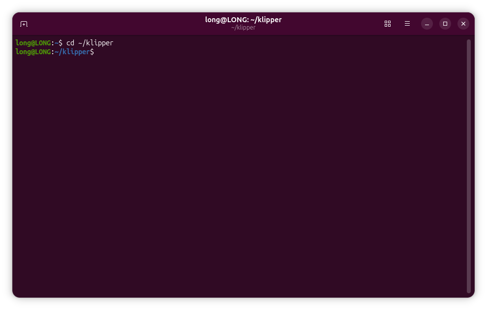
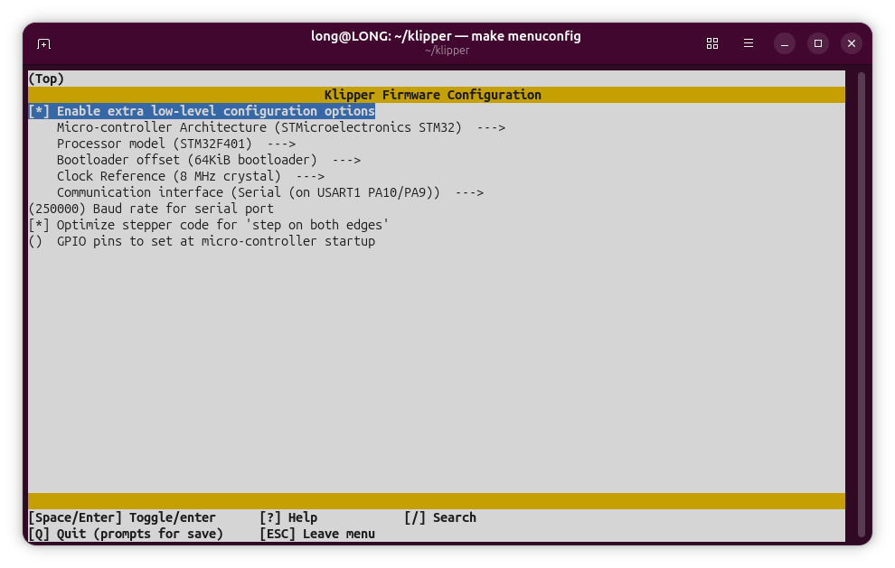
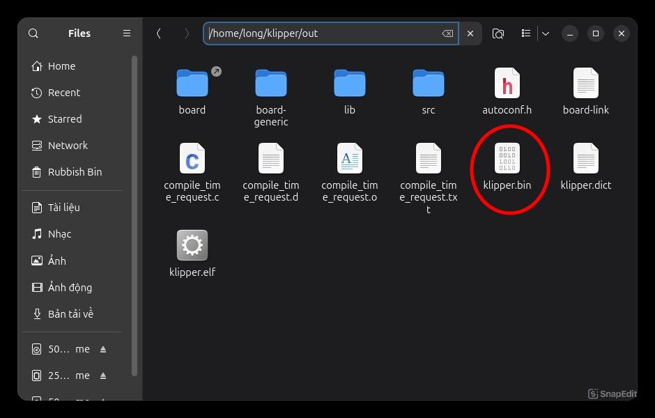
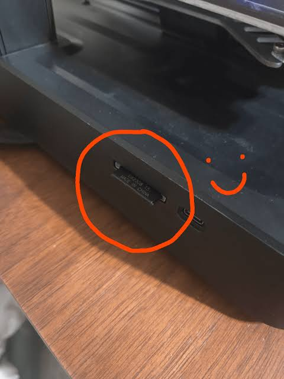

# Quy Trình Nạp File Bin
### BƯỚC 1: mở cmd nhập lệnh sau:
```ini
cd ~/klipper
```
<div align="center">
  
</div>

---

### BƯỚC 2: chọn cấu hình phù hợp với main của bạn:
```ini
make menuconfig
```
### [ chọn Q lưu lại cấu hình lại ]

<div align="center">
  
</div>

---

### BƯỚC 3: build file bin:
```ini
make
```
---
### BƯỚC 4: copy file bin vào thể nhớ
```ini
"file bin nằm ở đây" /home/long/klipper/out/klipper.bin
```

<div align="center">
  
</div>

```ini
hãy tạo file này trong thẻ SD của bạn: "STM32F4_UPDATE"
```
<h3> <a style="color: red" >Lưu ý:</a> đoạn này khá quan trọng dể biết <a style="color: red" >"BƯỚC 6"</a> thành công hay không: đổi tên <a>"klipper.bin"</a> thành tên khác VD: <a>"update.bin"</a> trước khi nạp firmwware.
</h3>

---

### BƯỚC 5 nạp file bin vào máy Ender3 v3 se.

<div align="center">
  
</div>
<div align="center" style="font-size: 20px; font-weight: bold; white-space: nowrap;"> cắm thẻ nhớ vào máy </div>


<div align="center">
  <video width="300" controls>
    <source src="IMG_9735.mp4" type="video/mp4">
  </video>
</div>
<div align="center" style="font-size: 20px; font-weight: bold; white-space: nowrap;"> Tắt máy đi bật lại như video </div>

---

### BƯỚC 6 Nhận biết nạp thành công

<div align="center">
  
</div>
<div align="center" style="font-size: 20px; font-weight: bold; white-space: nowrap;"> màn hình giữ nguyên như này là được </div>

<h3><p>Kiểm tra thêm bằng cách lấy thẻ sd sau khi nạp xong, cắm vào máy tính kiểm tra tên file đã đổi trước đó VD: <a>"update.bin"</a> tự đổi về <a>klipper.bin</a> là thành công </p>
</h3>

---

